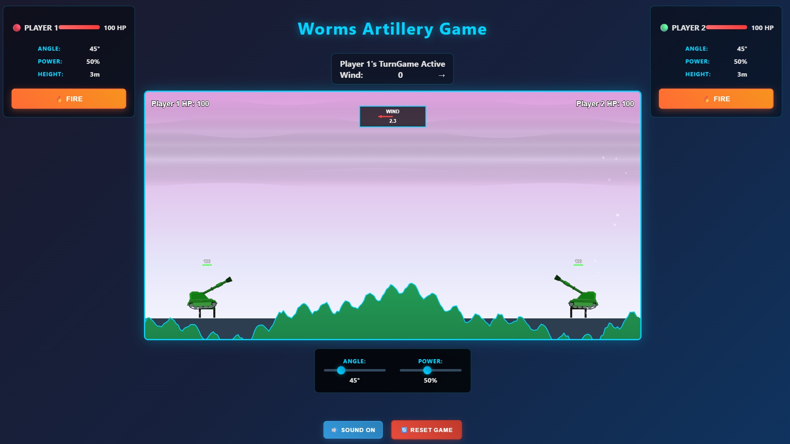

# 🎯 Worms Artillery Game

A modern, visually stunning Worms-style artillery game featuring dynamic Rive animations and atmospheric backgrounds.



## 🎮 Features

### ✨ **Dynamic Rive Animations**
- **Professional cannon animations** using Rive runtime
- **Real-time angle updates** via state machine inputs
- **Scaled 2x animations** (160x160) for enhanced visibility
- **Flipped Player 2 cannon** for gameplay clarity

### 🌫️ **Dynamic Atmospheric Backgrounds**
- **6 unique color palettes** that change each game:
  - Sky Blue
  - Pink Sunset
  - Purple Twilight
  - Golden Hour
  - Misty Green
  - Warm Beige
- **Animated fog layers** with organic, wavy shapes
- **Layered depth effects** with gradient transparency
- **Background regeneration** on game reset for variety

### 🎯 **Polished Gameplay**
- **Turn-based artillery combat** between two players
- **Adjustable angle and power** controls
- **Wind effects** that influence projectile trajectory
- **Health system** with visual health bars
- **Terrain destruction** with realistic physics
- **Clean, modern UI** with repositioned elements

## 🚀 Getting Started

### Prerequisites
- Modern web browser with HTML5 Canvas support
- Local web server (Python's http.server recommended)

### Installation & Setup

1. **Clone the repository:**
   ```bash
   git clone https://github.com/Amtrtm/ArtilleryGame.git
   cd ArtilleryGame
   ```

2. **Start a local web server:**
   ```bash
   python -m http.server 8000
   ```

3. **Open in browser:**
   Navigate to `http://localhost:8000` in your web browser

## 🎮 How to Play

1. **Player 1 starts** - adjust angle and power using the sliders
2. **Click "Fire!"** to launch your projectile
3. **Wind effects** will influence your shot trajectory
4. **Take turns** until one player's health reaches zero
5. **Click "Reset Game"** to start a new match with a fresh background

## 🛠️ Technical Details

### **Built With:**
- **HTML5 Canvas** for rendering
- **Rive Runtime** for professional animations
- **Vanilla JavaScript** (ES6+) for game logic
- **Modern CSS** for UI styling

### **Key Technical Features:**
- **Separate Rive instances** for each player
- **Performance-optimized rendering pipeline**
- **Real-time physics calculations**
- **Dynamic background generation system**
- **Responsive canvas scaling**

### **Rive Integration Pattern:**
```javascript
new rive.Rive({
    src: './Rive.riv',
    canvas: canvasElement,
    autoplay: true,
    stateMachines: 'State Machine 1',
    onLoad: () => {
        // Set dimensions after load
        instance.canvas.width = 160;
        instance.canvas.height = 160;
        
        // Cache state machine inputs
        const inputs = instance.stateMachineInputs('State Machine 1');
        instance.elevationInput = inputs.find(input => input.name === 'Elevation');
    }
});
```

## 📁 Project Structure

```
ArtilleryGame/
├── index.html          # Main game page
├── game.js             # Core game logic and rendering
├── Rive.riv           # Rive animation file
├── 512x512bb.jpg      # Game preview image
├── rive-test.html     # Rive animation test file
└── README.md          # This file
```

## 🎨 Visual Highlights

- **Professional Rive cannon animations** that respond to angle changes
- **Atmospheric fog effects** with sine wave organic shapes
- **Dynamic color palettes** for visual variety
- **Clean UI design** with health bars positioned above cannons
- **Smooth 60fps animations** throughout

## 🔧 Development Notes

### **Rive Animation Integration:**
The key to successful Rive integration was:
1. Using `src` loading instead of ArrayBuffer
2. Setting canvas dimensions AFTER Rive loads
3. Never calling `resizeDrawingSurfaceToCanvas()` (resets dimensions to 0)
4. Caching state machine inputs for performance

### **Background System:**
- Multiple fog layers with random properties
- Sine wave calculations for organic shapes
- Gradient transparency for depth effects
- Performance-optimized with controlled layer counts

## 🚀 Future Enhancements

- [ ] Multiplayer network support
- [ ] Additional weapon types
- [ ] Destructible terrain variations
- [ ] Sound effects and music
- [ ] Mobile touch controls
- [ ] Tournament mode

## 📄 License

This project is open source and available under the [MIT License](LICENSE).

## 🤝 Contributing

Contributions, issues, and feature requests are welcome! Feel free to check the [issues page](https://github.com/Amtrtm/ArtilleryGame/issues).

---

**Enjoy the game!** 🎯✨
